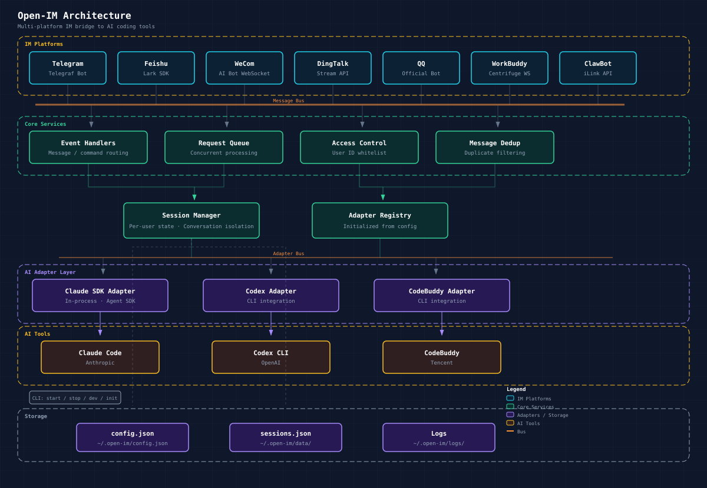

# open-im

**English** · [中文](./README.zh-CN.md)

Multi-platform IM bridge for AI CLI tools. Connect Telegram, Feishu, WeCom, DingTalk, QQ, WeChat (WorkBuddy), and WeChat (ClawBot) to Claude Code, Codex, and CodeBuddy — use your AI coding assistant from any phone or chat window.

## Architecture



## Features

- **Seven IM platforms** — Telegram, Feishu, WeCom, DingTalk, QQ, WorkBuddy, ClawBot
- **Three AI backends** — Claude (Agent SDK), Codex, CodeBuddy (per-platform override supported)
- **Streaming, media, sessions** — live output where supported; `/new` for a fresh AI session
- **Web UI** — dashboard bundled in the package; default **`http://127.0.0.1:39282`**

## Requirements

- Node.js ≥ 20
- At least one IM platform configured + credentials for your AI tool

## Quick start

```bash
npx @wu529778790/open-im start
```

Or: `npm install -g @wu529778790/open-im` then `open-im start`.

Config: **`~/.open-im/config.json`**

## CLI

| Command | Description |
| --- | --- |
| `open-im init` | Interactive setup (does not start the bridge) |
| `open-im start` | Run the bridge in the background |
| `open-im stop` | Stop the background bridge |
| `open-im restart` | Stop then start |
| `open-im dashboard` | Web config server only (no bridge) |

After `start`, the CLI prints the dashboard URL (default **`http://127.0.0.1:39282`**).

## Chat commands

| Command | Description |
| --- | --- |
| `/help` | Help |
| `/new` | New AI session |
| `/sessions` | Session history with preview |
| `/resume [N]` | Resume session (no arg = most recent) |
| `/status` | AI + session info |
| `/cd` / `/pwd` | Switch work dir (auto-resumes that dir's session) |
| `/allow` / `/y`, `/deny` / `/n` | Permission prompts |

## Session continuity

open-im and Claude Code CLI share the same session storage. In the same directory, you can seamlessly switch between phone and computer.

**Phone → Computer:** open-im auto-resumes the latest CLI session — no configuration needed.

**Computer → Phone:** use `claude --continue` (or `claude -c`) to pick up the phone conversation.

```
# On computer
cd /my-project && claude        # work as usual, then Ctrl+C

# On phone (via IM)
"help me fix the login bug"     # open-im auto-resumes the same session

# Back on computer
claude -c                       # continues the phone conversation
```

> Only one side can be active at a time. Exit the CLI before sending messages from the phone, and vice versa.

## Git co-authors

`Co-authored-by` is appended by default on AI-driven commits. **Disable:** set **`OPEN_IM_GIT_COAUTHOR=0`** in the environment and restart the bridge.

## Minimal config

```json
{
  "tools": {
    "claude": { "workDir": "/path/to/project", "skipPermissions": true, "timeoutMs": 600000 }
  },
  "platforms": {
    "telegram": { "enabled": true, "botToken": "YOUR_TELEGRAM_BOT_TOKEN" }
  }
}
```

Add other platforms under **`platforms`** as needed. Run **`open-im init`** for a full template.

### Claude (Agent SDK)

No local `claude` binary required. Third-party / compatible API:

```json
{
  "tools": {
    "claude": {
      "env": {
        "ANTHROPIC_AUTH_TOKEN": "your-token",
        "ANTHROPIC_BASE_URL": "https://your-api-endpoint",
        "ANTHROPIC_MODEL": "glm-4.7"
      }
    }
  }
}
```

### Per-platform AI

Set **`platforms.<name>.aiCommand`** (`claude` / `codex` / `codebuddy`) per channel. Default: `claude`.

### Web dashboard

`open-im start` serves the built-in SPA and **`/api/*`** on **`OPEN_IM_WEB_PORT`** (default **39282**). For LAN access: `export OPEN_IM_WEB_HOST=0.0.0.0`.

### Environment variables

Typical keys: **`ANTHROPIC_*`** (shell or **`tools.claude.env`**), **`TELEGRAM_BOT_TOKEN`**, **`OPEN_IM_WEB_PORT`**, **`OPEN_IM_WEB_HOST`**, plus platform-specific `*_APP_ID`, `*_SECRET`, `WORKBUDDY_*`, etc.

### Privacy

**Anonymous** usage information may be collected to improve reliability (no chat or prompt content). To disable: **`OPEN_IM_TELEMETRY=false`** or **`"telemetry": { "enabled": false }`** in **`config.json`**.

## Platform setup & troubleshooting

See **[docs/platforms.md](./docs/platforms.md)** for detailed per-platform configuration, credential setup, and troubleshooting.

## License

[MIT](LICENSE)
